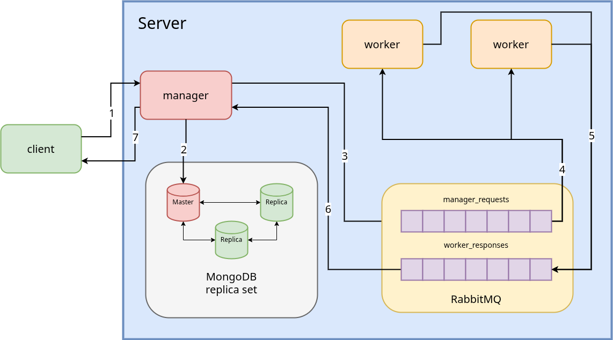

# Предисловие

Приложение CrackHash реализует распределённую систему для взлома хеша методом полного перебора слов опредленного словаря.
При этом предполагается реализация двух версий этого приложения в рамках двух лабораторных работ.

Общая логика работы приложения такая:

В рамках системы существует менеджер, который принимает от пользователя запрос, содержащий MD-5 хэш некоторого слова, а также его максимальную длину.
Менеджер обрабатывает запрос: генерирует задачи в соответствии с заданным числом воркеров (вычислительных узлов) на перебор слов составленных из переданного им алфавита. После чего отправляет их на исполнение воркерам. 
Каждый воркер принимает задачу, перебирает слова в заданном диапазоне и вычисляет их хэш. Находит слова у которых хеш совпадает с заданным, и результат работы возвращает менеджеру через очередь.

Версии приложения (вторая пока находится в процессе разработки) находятся в папках task1 и task2 соотвественно (task2 будет добавлена позже).
Более подробное описание первой лабораторной можно найти в разделе "Task 1.  Services Implementation".

# Task 1.  Services Implementation

В рамках первой лабораторной работы необходимо реализовать приложения менеджера и воркера, а также организовать простое их взаимодействие через HTTP.

> [!TIP]
> *Примечание: Настройка очередей и producer-ов/listener-ов для них в рамках данной задачи не предполагается!*

## Общие требования к сервисам:

 - Для развертывания сервисов необходимо использовать docker-compose, конфигурация с одним воркером. 
 - Запросы между менеджером и воркером необходимо передавать внутри сети docker-compose по протоколу HTTP, используя в качестве доменов имена сервисов.

## Требования к менеджеру

 - Менеджер должен предоставлять клиенту REST API в формате JSON для взаимодействия с ним.

    Запроса на взлом хэша (слово abcd):
    ```sh
    POST /manager/api/hash/crack
    Request body:
    {
        "hash":"e2fc714c4727ee9395f324cd2e7f331f", 
        "maxLength": 4
    }
    ```

    В ответ менеджер должен отдавать клиенту идентификатор запроса, по которому тот сможет обратится за получением ответа.
    ```sh
    Response body:
    {
        "requestId":"730a04e6-4de9-41f9-9d5b-53b88b17afac"
    }
    ```

 - Для получения результатов менеджер должен представлять следующее API.

    ```sh
    GET /manager/api/hash/status?requestId=730a04e6-4de9-41f9-9d5b-53b88b17afac
    ```

    Ответ,  если запрос еще обрабатывается.
    ```sh
    Response body:
    {
        "status":"IN_PROGRESS",
        "data": null
    }
    ```

    Ответ,  если ответ готов.
    ```sh
    Response body:
    {
        "status":"READY",
        "data": ["abcd"]
    }
    ```

 - В качестве алфавита менеджер должен использовать строчные латинские буквы и цифры (ограничимся ими в целях экономии времени на вычисления).
 - Взаимодействие между менеджером и воркерами должно быть организовано в формате JSON. Поэтому необходимо сгенерировать модель запроса менеджера к воркеру на основе xsd-схемы. Далее запросы для воркеров заполнять в соответствии с моделью.
 - Перед отправкой задач воркерам менеджер должен сохранить в оперативной памяти информацию о них с привязкой к запросу клиента в статусе IN_PROGRESS под идентификатором, который после должен быть выдан пользователю. При получении ответов от всех воркеров менеджер должен перевести статус запроса в READY. По истечению таймаута запрос должен перевестись в статус ERROR.
 - Для работы с состоянием запросов использовать потокобезопасные коллекции.
 - Взаимодействие с воркером организовать по протоколу HTTP с помощью Rest Template. Для этого в воркере необходимо реализовать контроллер для обработки запросов от менеджера, принимающий запрос по следующему пути:
    ```sh
    POST /worker/internal/api/hash/crack/task
    ```


## Требования к воркерам:
 - Взаимодействие между воркером и менеджером также должно быть организовано в формате XML. Поэтому необходимо сгенерировать модель запроса ответа воркера на основе xsd-схемы. Ответ для менеджера заполнять в соответствии с моделью.
 - Взаимодействие с менеджером организовать по протоколу HTTP с помощью Rest Template. Для этого в менеджере необходимо реализовать контроллер для обработки ответов от воркера по следующему пути:
    ```sh
    PATCH /manager/internal/api/hash/crack/request
    ```
 - Для генерации слов на основе полученного алфавита можно использовать библиотеку combinatoricslib3. Она позволяет генерировать перестановки с повторениями заданной длины на основе заданного множества. Ключевое условие здесь, чтобы воркер не держал в памяти все сгенерированные комбинации т.к. при увеличении максимальной длины последовательности их банально станет очень много. Для этого библиотека предоставляет итератор по множеству комбинаций.
 - Расчет диапазона слов необходимо производить на основе значений PartNumber и PartCount из запроса от менеджера. Необходимо поделить всё пространство слов поровну между всеми воркерами.

# Task 1.  Services Implementation

В рамках второй лабораторной работы необходимо модифицировать систему таким образом, чтобы обеспечить гарантированную обработку запроса пользователя (если доступен менеджер) т.е. обеспечить отказоустойчивость системы в целом.

## Основные требования

1. Обеспечить сохранность данных при отказе работы менеджера
    1. Для этого необходимо обеспечить хранение данных об обрабатываемых запросах в базе данных
    1. Также необходимо организовать взаимодействие воркеров с менеджером через очередь RabbitMQ
        1. Для этого достаточно настроить очередь с direct exchange-ем
        1. Если менеджер недоступен, то сообщения должны сохраняться в очереди до момента возобновления его работы
    1. RabbitMQ также необходимо разместить в окружении docker-compose
1. Обеспечить частичную отказоустойчивость базы данных
    1. База данных также должна быть отказоустойчивой, для этого требуется реализовать простое реплицирование для нереляционной базы MongoDB
    1. Минимально рабочая схема одна primary нода, две secondary
    1. Менеджер должен отвечать клиенту, что задача принята в работу только после того, как она была успешно сохранена в базу данных и отреплицирована
1. Обеспечить сохранность данных при отказе работы воркера(-ов)
    1. В docker-compose необходимо разместить, как минимум, 2 воркера
    1. Организовать взаимодействие менеджера с воркерами через очередь RabbitMQ (вторая, отдельная очередь), аналогично настроить direct exchange
    1. В случае, если любой из воркеров при работе над задачей ”cломался” и не отдал ответ, то задача должна быть переотправлена другому воркеру, для этого необходимо корректно настроить механизм acknowledgement-ов
    1. Если на момент создания задач нет доступных воркеров, то сообщения должны дождаться их появления в очереди, а затем отправлены на исполнение
1. Обеспечить сохранность данных при отказе работы очереди
    1. Если менеджер не может отправить задачи в очередь, то он должен сохранить их у себя в базе данных до момента восстановления доступности очереди, после чего снова отправить накопившиеся задачи
    1. Очередь не должна терять сообщения при рестарте (или падении из-за ошибки), для этого все сообщения должны быть персистентными (это регулируется при их отправке)

## Кейсы, которые необходимо учесть

1. стоп сервиса менеджера в docker-compose 
    1. полученные ранее ответы от воркеров должны быть сохранены в базу и не должны потеряться
    1. не дошедшие до менеджера ответы на задачи не должны потеряться, менеджер должен подобрать их при рестарте
1. стоп primary ноды реплик-сета MongoDB в docker-compose 
    1. primary нода должна измениться, в система продолжать работу в штатном режиме
1. стоп RabbitMQ в docker-compose
    1. все необработанные, на момент выключения очереди, сообщения после рестарта не должны потеряться
1. стоп воркера во время обработки задачи
    1. сообщение должно быть переотправлено другому воркеру, задача не должна быть потеряна

## Допущения

При рестарте RabbitMQ сбрасывает статус отправленных сообщений (персистентных) из unacked в ready. Поэтому, например, допускается повторная обработка одной задачи двумя воркерами, что нужно учесть в логике менеджера.

# Итоговая схема системы


> [!TIP]
> Схема в формате drawio: [тык](./Task2_scheme.drawio)

# Команда для запуска
```sh
docker-compose up
```
в корне проекта.